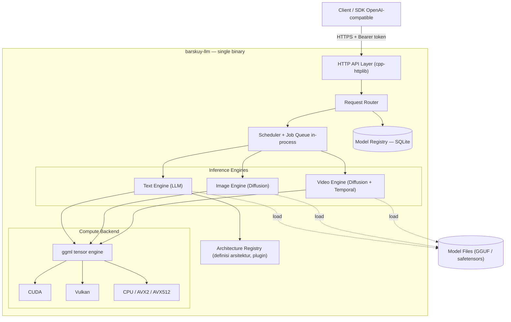
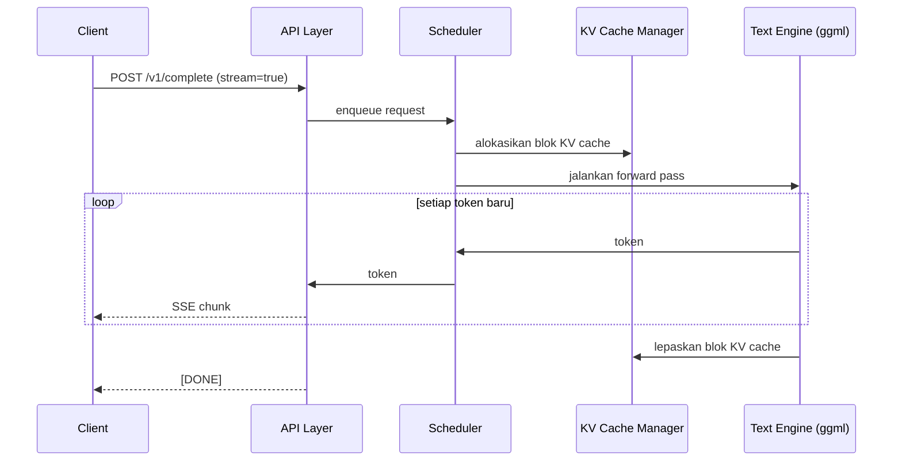
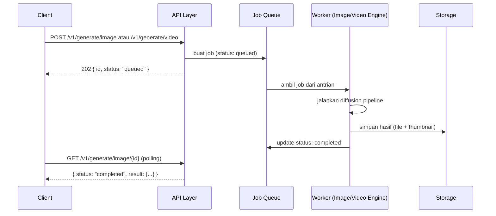
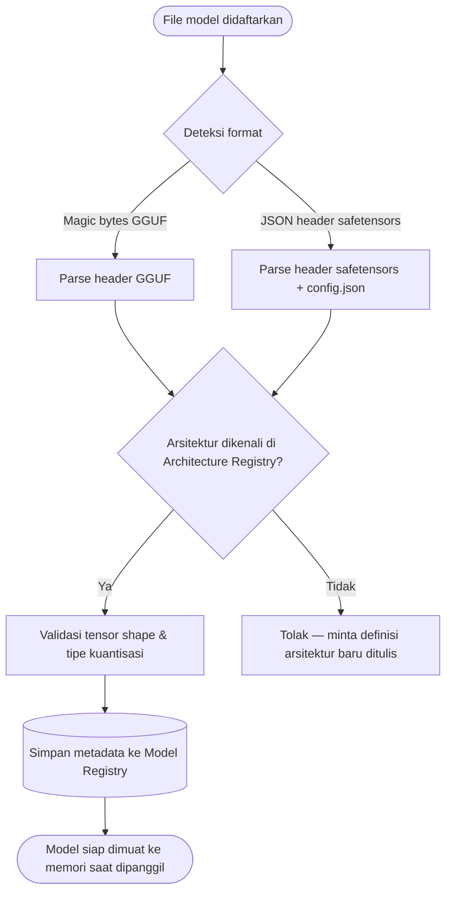

# Arsitektur — barskuy-llm

> Bagian dari dokumen PRD barskuy-llm. File terkait: [stack.md](./stack.md) · [desain.md](./desain.md) · [backend.md](./backend.md) · [frontend.md](./frontend.md) · [task.md](./task.md)

## 1. Latar Belakang

barskuy-llm adalah jawaban atas satu pertanyaan yang sudah lama muncul: kenapa harus pilih antara llama.cpp atau vLLM kalau kebutuhannya sebenarnya "keduanya, sekaligus, dalam satu server"? llama.cpp menang di portabilitas dan efisiensi GGUF di hardware terbatas, vLLM menang di throughput serving lewat PagedAttention dan continuous batching untuk model safetensors. Selama ini kalau mau dua-duanya, jalan satu-satunya adalah menjalankan dua server terpisah dengan dua ekosistem yang tidak saling kenal.

Tujuan proyek ini bukan sekadar "bikin ulang" dua tool itu, tapi menyatukan ide inti keduanya di atas satu compute substrate — ggml, tensor library yang sama yang jadi tulang punggung llama.cpp dan juga stable-diffusion.cpp — supaya GGUF, safetensors, generate teks, generate gambar, dan generate video bisa jalan dari satu binary yang sama, tanpa harus rebuild ulang tiap kali ada arsitektur model baru yang belum didukung upstream.

Ini juga langsung menjawab beberapa masalah nyata yang sudah pernah ditemui: model dengan tipe tensor kustom (kasus PrismML `PQ2_0` yang cuma jalan di fork sendiri), arsitektur baru yang belum ada di llama.cpp mainline (Nanbeige 4.2, dsb), dan kebutuhan untuk switch antar banyak model tanpa restart total server. Ketiganya jadi requirement inti, bukan nice-to-have.

## 2. Prinsip Arsitektur

Lima prinsip ini yang memandu setiap keputusan desain di file-file lain:

1. **Satu binary, satu compute substrate.** Semua jenis inferensi (teks, gambar, video) jalan di atas ggml. Tidak ada proses Python terpisah yang harus di-subprocess-kan, karena itu akan merusak tujuan "satu binary" dari awal.
2. **Arsitektur model sebagai plugin, bukan hardcode.** Setiap kali muncul arsitektur baru, itu seharusnya masalah "tambah definisi", bukan "tunggu PR upstream" atau "cari fork orang lain".
3. **Kompatibilitas gaya OpenAI, bukan replika 1:1.** Endpoint mengikuti konvensi yang diminta (`v1/complete`, `v1/generate/image`, `v1/generate/video`), dengan alias ke endpoint resmi OpenAI supaya SDK resmi tetap bisa connect tanpa modifikasi.
4. **Skala adaptif.** Sistem harus tetap masuk akal di laptop dengan VRAM 6GB, tapi tidak dihardcode untuk skala itu — konfigurasi offload/tensor-split membuatnya tetap relevan di GPU yang lebih besar.
5. **Degradasi graceful.** Kalau resource GPU tidak cukup, sistem turun ke hybrid CPU-GPU offload atau SSD-streaming, bukan langsung OOM dan mati.

## 3. Diagram Arsitektur Tingkat Tinggi

Catatan pembacaan diagram: yang ada di dalam kotak `BIN` semuanya hidup dalam satu proses/binary. Tidak ada panah yang keluar-masuk lewat jaringan internal (localhost RPC, Redis, dsb) — komunikasi antar komponen adalah pemanggilan fungsi langsung. Ini keputusan sadar, bukan kelalaian; lihat bagian 9 soal kapan ini bisa berubah.

## 4. Komponen Sistem

### 4.1 HTTP API Layer
Menerima request, validasi bentuk JSON, cek API key, lalu serahkan ke Router. Untuk endpoint streaming (`stream: true` pada `/v1/complete`), layer ini yang menangani koneksi SSE tetap terbuka selama token terus mengalir dari Scheduler. Detail kontrak di [desain.md](./desain.md#kontrak-api).

### 4.2 Request Router
Menentukan request ini masuk ke engine mana berdasarkan field `model` di body request, dicocokkan ke Model Registry. Kalau model belum dimuat ke memori, Router yang memicu proses load (dengan kemungkinan unload model lain dulu kalau VRAM tidak cukup — pola yang sama seperti llama-swap).

### 4.3 Scheduler + Job Queue
Dua peran berbeda dalam satu komponen:
- Untuk teks: mengatur antrian request yang masuk ke continuous batching (lihat detail di [backend.md](./backend.md#text-engine)).
- Untuk image/video: mengelola job yang bersifat async — job masuk antrian, worker ambil satu per satu (atau beberapa sekaligus kalau VRAM cukup), status di-track sampai selesai.

Job queue di v1 disimpan in-process (in-memory + snapshot ke SQLite supaya history job tidak hilang saat restart), bukan Redis terpisah — konsisten dengan prinsip satu binary.

### 4.4 Text Engine
Menjalankan forward pass untuk model bahasa. Dua jalur loading:
- **GGUF** — native lewat ggml, mendukung seluruh matriks kuantisasi (lihat [stack.md](./stack.md#matriks-kuantisasi)).
- **Safetensors** — loader native yang membaca header JSON + `config.json`, memetakan nama tensor HuggingFace ke graph ggml sesuai definisi di Architecture Registry, lalu menjalankan dequantization kernel yang sesuai (AWQ/GPTQ/FP8/NF4/unquantized).

Detail lengkap fitur serving (continuous batching, paged KV cache, speculative decoding, dst) ada di [backend.md](./backend.md).

### 4.5 Image Engine
Pipeline diffusion (UNet/DiT + VAE + text encoder) dijalankan native di atas ggml, mengikuti pola yang sudah terbukti di proyek stable-diffusion.cpp. Mendukung SD1.5, SDXL, dan arsitektur DiT yang lebih baru (FLUX-style) sebagai target awal.

### 4.6 Video Engine
Perluasan dari Image Engine dengan temporal/motion module. Ini bagian paling eksperimental dari seluruh proyek — dukungan video diffusion di atas ggml jauh lebih belum matang dibanding image, jadi kemungkinan besar akan butuh kernel kustom yang ditulis sendiri, bukan sekadar port dari implementasi yang sudah ada. Fase pengerjaan sengaja diletakkan paling akhir (lihat bagian 9).

### 4.7 Architecture Registry
Ini komponen yang secara langsung menjawab masalah "arsitektur belum didukung" yang berulang kali muncul. Setiap arsitektur (Llama, Qwen, Gemma, Nanbeige, MoE kustom, dst) didefinisikan secara deklaratif: pemetaan nama tensor, jumlah layer, tipe attention (dense/MoE/hybrid SSM), dan template graph komputasi. Menambah arsitektur baru = menulis satu file definisi baru, bukan menyentuh core engine. Detail format definisi di [desain.md](./desain.md#pola-arsitektur-plugin).

### 4.8 Model Registry (SQLite)
Menyimpan metadata semua model yang terdaftar: path file, format, tipe kuantisasi, arsitektur, kapabilitas (teks/gambar/video), status (loaded/unloaded), dan riwayat penggunaan. SQLite dipilih karena cocok untuk deployment single-machine dan tidak menambah dependency layanan eksternal.

### 4.9 Compute Backend
Lapisan paling bawah — ggml dengan backend CUDA, Vulkan, dan CPU (AVX2/AVX512), dengan ROCm dan Metal sebagai target sekunder. Mendukung build hybrid CUDA+Vulkan dalam satu binary, offload expert MoE ke CPU (`--n-cpu-moe`-style), dan streaming model besar dari SSD supaya model yang lebih besar dari VRAM tetap bisa jalan tanpa OOM.

## 5. Alur Request

### 5.1 Text Completion (streaming)

### 5.2 Image / Video Generation (async job)

Kenapa image juga dibuat async, padahal secara teknis bisa cukup cepat untuk direspons langsung? Konsistensi. Kalau image kadang sync kadang async tergantung model/parameter, client harus menangani dua pola berbeda. Lebih aman satu pola job-based untuk semua generasi non-teks, dengan opsi `wait: true` di request body untuk kasus di mana client memang mau menunggu di koneksi yang sama (server tetap generate job id, tapi menahan response sampai selesai atau timeout).

## 6. Model Loading & Format Detection

Kasus seperti `PQ2_0` (tipe tensor ternary kustom milik PrismML) akan berhenti di langkah `ArchMatch` sampai ada definisi kuantisasi yang eksplisit ditambahkan ke registry — jadi gagalnya jelas dan actionable, bukan crash dengan pesan error ggml yang samar.

## 7. Strategi Offload & Skalabilitas Hardware

Target validasi utama adalah laptop dengan VRAM 6GB (RTX 3050 Laptop, 12GB RAM sistem), tapi konfigurasi tidak di-hardcode untuk ukuran itu. Tiga mekanisme offload jadi fitur native, bukan tambahan belakangan:

- **CPU MoE offload** — expert yang jarang aktif pada model MoE dipindah ke RAM sistem, mirip pola `--n-cpu-moe` yang sudah dipakai. Sisa expert yang sering aktif tetap di VRAM.
- **SSD streaming** — untuk model yang jauh lebih besar dari VRAM+RAM gabungan, layer di-stream dari disk sesuai kebutuhan (pola ala Colibri), dengan prioritas menjaga latency token pertama tetap rendah.
- **Tensor split multi-GPU** — untuk deployment dengan lebih dari satu GPU, model displit antar device. Ini juga jalur yang sama dipakai kalau nanti proyek berkembang ke skala di luar satu laptop.

## 8. Continuous Batching & Paged KV Cache — Cakupan yang Realistis

Ini bagian yang penting untuk jujur soal skalanya. Continuous batching dan PagedAttention di vLLM asli dirancang untuk serving multi-tenant skala data center dengan puluhan-ratusan request bersamaan di banyak GPU. barskuy-llm mengambil **ide algoritmiknya** — alokasi KV cache berbasis blok (bukan buffer kontinu per sequence), dan penjadwalan dinamis (bukan batch statis) — lalu diimplementasikan native dalam skala yang masuk akal untuk satu-beberapa GPU lokal. Ini bukan klaim replikasi PagedAttention data-center-scale; ini adalah versi yang tepat untuk skala pemakaian nyata proyek ini, dengan jalur upgrade yang jelas kalau suatu saat memang dibutuhkan skala lebih besar (lihat bagian 9, Fase 3 dan seterusnya).

## 9. Roadmap Evolusi

Detail task per fase ada di [task.md](./task.md). Ringkasan urutannya:

| Fase | Fokus | Kenapa urutannya begini |
|---|---|---|
| 0 | Fondasi — embed ggml, build CMake Windows, skeleton HTTP server, skema SQLite | Semua fase lain bergantung ke sini |
| 1 | Text Engine + GGUF penuh, `/v1/complete`, `/v1/models`, streaming | Ini yang paling matang secara teknis (ggml sudah battle-tested untuk GGUF) — validasi arsitektur dari fitur yang risikonya paling rendah |
| 2 | Safetensors loader + Architecture Registry + kuantisasi AWQ/GPTQ/FP8/NF4 | Menyusul setelah pipeline dasar terbukti jalan; ini yang menyelesaikan masalah "arsitektur belum didukung" |
| 3 | Continuous batching, paged KV cache, MoE CPU offload, SSD streaming, tensor split | Peningkatan performa serving — butuh Text Engine yang sudah stabil dulu sebagai baseline |
| 4 | Image Engine (SD1.5/SDXL), `/v1/generate/image` | Substrat ggml sudah matang dari fase 1-3, tinggal ekstensi ke domain diffusion |
| 5 | Video Engine, `/v1/generate/video` | Paling eksperimental — sengaja terakhir supaya risiko R&D tidak memblokir fitur lain |
| 6 | Frontend, API key management, observability, polish | Butuh backend yang sudah stabil untuk di-consume |

## 10. Integrasi dengan Proyek Lain

- **barskuyai-proxy** bisa menjadikan barskuy-llm sebagai salah satu backend provider begitu endpoint `/v1/complete` sudah jalan — proxy tinggal forward request ke barskuy-llm seperti provider lain, karena kontraknya sudah gaya OpenAI.
- **barskuy-agent** (stack RAG/MCP self-hosted) adalah kandidat konsumen utama endpoint `/v1/embeddings` dan `/v1/complete` begitu barskuy-llm menggantikan kombinasi llama-swap + llama.cpp server yang dipakai sekarang.

Kedua integrasi ini tidak masuk cakupan v1, tapi arsitektur ini sengaja dibuat supaya jalur integrasinya tidak butuh perubahan besar saat waktunya tiba.

## 11. Referensi Silang

- Pilihan teknologi tiap komponen → [stack.md](./stack.md)
- Kontrak API lengkap, skema data, pola desain → [desain.md](./desain.md)
- Detail implementasi tiap service backend → [backend.md](./backend.md)
- Detail implementasi UI → [frontend.md](./frontend.md)
- Breakdown task, status, dan log bug → [task.md](./task.md)
